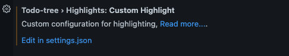
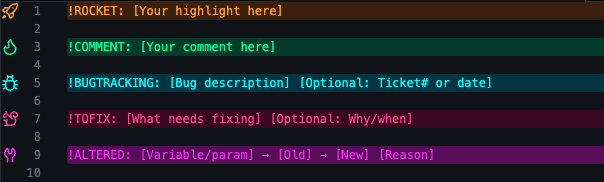

### Download from Extensions sidebar on vscode or from the marketplace:
https://marketplace.visualstudio.com/items?itemName=Gruntfuggly.todo-tree

### How to add and customize your commands?
* Go to settings (command + ,)
* search: tree highlight
* Go to `edit in settings.json`

* add the `.json` snippet in this repository
* enjoy :)

### Commands used in the `.json` file are
* 🚀 **!ROCKET:**
* 🔥 **!COMMENT:**
* 🐿️ **!TOFIX:** 
* 🛠️ **!ALTERED:**
* 🐞 **BUGTRACKING:**
* 🔔 **!ADDED:**

### Command Palette Preview

